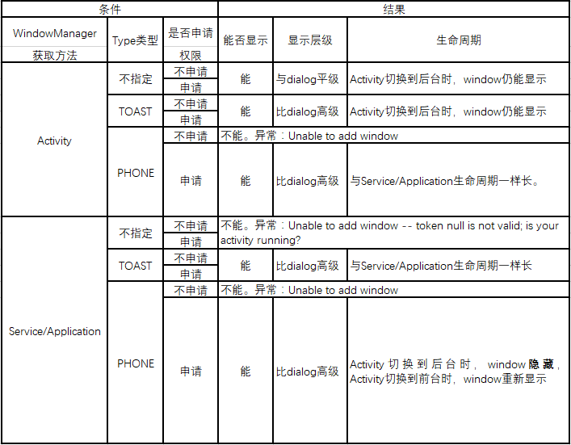

### 因为项目App中要使用到浮窗，因此考虑模仿360浮窗的实现方式。当然只是App内部用，并不需要使用service来达到全局浮窗的效果。由于Android本身有对使用系统级Window的权限API，以及国内不同手机厂商对浮窗的权限限制，有必要测试对不同条件下的显示效果，最终测试结果如下：
  

- 小米手机上比较特殊，只要是指定了Type类型，都需要在AndroidManifest.xml中声明“android.permission.SYSTEM_ALERT_WINDOW”权限，且手动启用权限（安全中心-授权管理-应用权限管理-XX应用-显示悬浮窗-允许），才能显示悬浮window；  
- 不同的手机安全策略不一样。以vivo x6D为例，当指定了Type类型，且类型是TYPE_TOAST以外时，除了需要在AndroidManifest.xml中声明“android.permission.SYSTEM_ALERT_WINDOW”权限，同样也需要手动启用权限（i管家-软件管理-悬浮窗管理-xx应用-开启），否则在应用类悬浮window能够正常显示，然而一旦app切换到后台，悬浮window会隐藏，直到app再次切换回前台，悬浮window才会重新显示；  
- 在targetSdkVersion大于等于23时，悬浮窗权限默认是关闭没有权限，然在小于23版本下编译悬浮窗权限是开启有权限的。所以在大于23版本下编译时，每次都需要使用悬浮window时需要使用动态权限机制去检测应用是否有悬浮窗权限“Settings.ACTION_MANAGE_OVERLAY_PERMISSION”，也可手动开启、禁用（三星S6：设置-应用程序-应用程序管理器-更多-可出现在顶部的应用程序-选择你的APP-运行在其他应用的上层显示）；  
- 根据[Android无需权限显示悬浮窗, 兼谈逆向分析app](http://www.jianshu.com/p/167fd5f47d5c)这篇文章指出：TYPE_TOAST一直都可以显示, 但是用TYPE_TOAST显示出来的在2.3上无法接收点击事件。