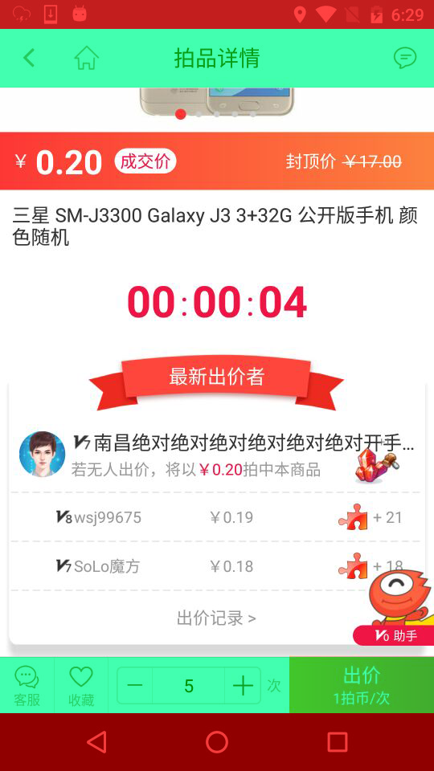
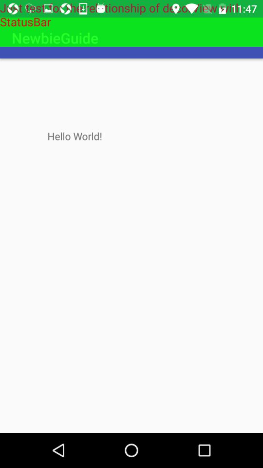

> 在项目中使用WindowManger加载View实现悬浮可拖动View的时候发现：通过WindowManager.LayoutParams来调整View在屏幕中的位置，要想达到预期效果，必须正确理解区分屏幕坐标系，Window坐标系，触摸坐标系，View坐标系之间的关系。

## 直观说明几种坐标系之间的关系

* 分辨率信息：
	* 手机型号：Nexus 5
	* 分辨率为：1080 * 1920
	* 版本号：6.0.1
* 屏幕坐标数据：
	* StatusBar(顶部状态栏)高度：72px
	* NavigationBar(底部导航栏)高度：144px
	* Screen(屏幕)高度：1776px
	* (WindowManager.LayoutParams).y max(最大值)：1704px
	* (WindowManager.LayoutParams).y max(最大值)：0px
	* 使用View.getLocationInWindow()方法定位titleBar，其y轴方向的坐标为：72px
	* 将FloatView(悬浮控件)移动到状态栏下方，使用View.getLocationInWindow()方法定位FloatView，其y轴方向的坐标为：0px(***第一次显示为72px，然后马上显示0px，原因未知，待研究！！！***)；其(WindowManager.LayoutParams).y为：0px

## 详细说明
 - Screen(屏幕)高度包括状态栏高度，但没有包括导航栏高度；
 - 在触摸控件的时候，getY和getRawY的坐标系原点分别为控件左上角、屏幕左上角。即getRawY返回的Y轴坐标高度是包括状态栏高度的；
 - 使用(WindowManager.LayoutParams).y改变View在Window中的位置时，y是以当前Window左上角为坐标原点的，也就是说对于没有设置FLAG_FULLSCREEN标记位的Window来说，y是不包括状态栏高度的；
 - 使用(WindowManager.LayoutParams).y改变View在Window中的位置时，y最大值可以设置为（ScreenHeihgt - StatusBarHiehgt）。但是要注意，因为FloatView本身是有一定高度的，此时将FloatView的y设置为最大值，FloatView依然不会超出屏幕。在处理触摸事件时，这点很重要。

### 关于DecorView与StatusBar
 * DecorView是一个Activity的Window里面的顶级视图，是一个FrameLayout，DecorView只有一个子View(LinearLayout)，子View里有两个子控件(FrameLayout)，分别是TitleBar和ContentView。
 * DecorView是从屏幕左上角开始的，即包含了状态栏。但是状态栏属于系统UI，是一个单独的系统Window，且显示层级非常高。因此，虽然DecorView包含状态栏，但是系统内部应该做了处理，例如设置PaddingTop之类，使其子View绘制的时候不会与状态栏重叠。
 * 在Android 5.0以后，系统开放了系统状态栏的部分API，FrameWork层可以控制显示系统状态栏的部分特性，如状态栏透明，变色等。此时，DecorView的子控件可能会绘制在StatusBar层级下，即重叠显示、被系统状态栏覆盖。因此，需要合理设置fitsystemwindows属性来帮助系统正确摆放DecorView子控件的位置。

## 示例代码1（WindowManager.LayoutParam，TouchEvent.getRawY，View.getLocationOnScreen之间的坐标关系）

	public class FloatingViewManager {
	
	    private static final int DEFAULT_TITLE_BAR_HEIGHT = (int) UIUtil.getDimen(R.dimen.x100);
	    private static final int FLOAT_VIEW_HEIGHT = (int) UIUtil.getDimen(R.dimen.x160);
	
	    private float mXInScreen; //记录当前手指位置在屏幕上的横坐标值 (以当前屏幕左上角为坐标原点，包括状态栏在内)
	    private float mYInScreen; //记录当前手指位置在屏幕上的纵坐标值
	    private float mXDownInScreen; //记录手指按下时在屏幕上的横坐标的值
	    private float mYDownInScreen; //记录手指按下时在屏幕上的纵坐标的值
	    private float mXInView; //记录手指按下时在小悬浮窗的View上的横坐标的值 (以当前View左上角为坐标原点)
	    private float mYinView; //记录手指按下时在小悬浮窗的View上的纵坐标的值
	    private int mScreenWidth; //屏幕的宽度
	    private int mScreenHeight; //屏幕的高度
	    private int mBarHeight; //状态栏的高度
	    private int mTitleBarHeight; //标题栏高度，限制在标题栏下方移动
	    private int mBottomBarHeight; //底部栏高度，限制在底部栏上方移动
	    private static int sLocationY = -1; //全局静态变量储存悬浮View的位置
	
	    private FloatView mFloatView;
	    private WeakReference<Activity> mActivity;
	    private WindowManager mWindowManager;
	    private WindowManager.LayoutParams mWmParams;   //浮窗View的坐标信息，以Activity的window左上角为坐标原点，即不包括状态栏
	    private ViewConfiguration mViewConfiguration;
	
	    private CountDownTimer mHideTimer; //用于 定时 隐藏 view的定时器
	    private final long mHideTime = 3000; //指定隐藏view的时长
	    private boolean isDraging = false; //标记是否拖动中
	    private boolean hasConsume = false; //标记Touch事件是否被消费，解决与OnClick事件的冲突
	    private boolean isShowing = false; //标记floatView是否在显示
	
	    /**
	     * 这个事件用于处理移动、自定义点击或者其它事情，return true可以保证onclick事件失效
	     */
	    private View.OnTouchListener mTouchListener = new View.OnTouchListener() {
	        @Override
	        public boolean onTouch(View v, MotionEvent event) {
	            switch (event.getAction()) {
	                case MotionEvent.ACTION_DOWN:
	                    hasConsume = false;
	                    onTouchDownAction(event);
	                    break;
	                case MotionEvent.ACTION_MOVE:
	                    hasConsume = onTouchMoveAction(event);
	                    break;
	                case MotionEvent.ACTION_UP:
	                case MotionEvent.ACTION_CANCEL:
	                    onTouchUpAction();
	                    break;
	            }
	            return hasConsume;
	        }
	    };
	
	    public FloatingViewManager(Activity activity) {
	        this.mActivity = new WeakReference<Activity>(activity);
	        mWindowManager = activity.getWindowManager();
	        mViewConfiguration = ViewConfiguration.get(activity);
	    }
	
	    public void showView() {
	        Activity activity = mActivity.get();
	        if (activity == null || activity.isFinishing() || mWindowManager == null) {
	            throw new IllegalArgumentException("Activity = null, " +
	                    "or Activity is isFinishing ,or this Activity`s  token is bad");
	        }
	
	        if (null == mFloatView) {
	            initView();
	        }
	
	        initWindowParam();
	        initFloatView();
	        initListener();
	        initTimer();
	
	        isShowing = true;
	    }
	
	    public void dismissView() {
	        //记录悬浮View本次的停放位置，以备下次恢复
	        sLocationY = mWmParams.y;
	        mFloatView.clearAnimation();
	        try {
	            mHideTimer.cancel();
	            mWindowManager.removeViewImmediate(mFloatView);
	        } catch (Exception e) {
	            e.printStackTrace();
	        }
	
	        isShowing = false;
	    }
	
	    public void setTitleBarHeight(int height) {
	        this.mTitleBarHeight = height;
	    }
	
	    public void setBottomBarHieght(int height) {
	        this.mBottomBarHeight = height;
	    }
	
	    public FloatView getFloatView() {
	        return mFloatView;
	    }
	
	    private void initView() {
	        if (mFloatView == null) {
	            mFloatView = new FloatView(mActivity.get());
	        }
	
	        Point outSize = new Point();
	        mWindowManager.getDefaultDisplay().getSize(outSize);
	        mScreenWidth = outSize.x;
	        mScreenHeight = outSize.y;
	        mTitleBarHeight = DEFAULT_TITLE_BAR_HEIGHT;
	
	        //判断状态栏是否显示 如果不显示则statusBarHeight为0
	        WindowManager.LayoutParams attrs = mActivity.get().getWindow().getAttributes();
	        if ((attrs.flags & WindowManager.LayoutParams.FLAG_FULLSCREEN)
	                == WindowManager.LayoutParams.FLAG_FULLSCREEN) {
	            mBarHeight = 0;
	        } else {
	            mBarHeight = getStatusBarHeight(mActivity.get());
	        }
	    }
	
	    private void initWindowParam() {
	        mFloatView.measure(0, 0);
	
	        mWmParams = new WindowManager.LayoutParams();
	        mWmParams.format = PixelFormat.RGBA_8888;
	        mWmParams.flags = WindowManager.LayoutParams.FLAG_NOT_FOCUSABLE;
	        mWmParams.gravity = Gravity.LEFT | Gravity.TOP;
	        mWmParams.x = mScreenWidth - mFloatView.getMeasuredWidth();
	        if (sLocationY != -1) {
	            mWmParams.y = Math.min(sLocationY, mScreenHeight - FLOAT_VIEW_HEIGHT - mBarHeight - mBottomBarHeight);
	        } else {
	            mWmParams.y = (int) (mScreenHeight - (FLOAT_VIEW_HEIGHT + mBottomBarHeight + mBarHeight) * 1.1f);
	        }
	        mWmParams.width = WindowManager.LayoutParams.WRAP_CONTENT;
	        mWmParams.height = WindowManager.LayoutParams.WRAP_CONTENT;
	    }
	
	    private void initFloatView() {
	        mWindowManager.addView(mFloatView, mWmParams);
	    }
	
	    private void initListener() {
	        mFloatView.setOnTouchListener(mTouchListener);
	
	        mFloatView.setOnClickListener(new View.OnClickListener() {
	            @Override
	            public void onClick(View v) {
	                if (!isDraging) {
	                    mFloatView.setOnTouchListener(mTouchListener);
	                    mHideTimer.start();
	                }
	                if (null == mActivity.get() || mActivity.get().isFinishing()) {
	                    return;
	                }
	                // TODO: 2017/9/14 点击事件
	            }
	        });
	    }
	
	    private void initTimer() {
	        mHideTimer = new CountDownTimer(mHideTime, 10) { //悬浮窗超过固定时长没有操作的话会自动隐藏
	            @Override
	            public void onTick(long millisUntilFinished) {
	                // TODO: 2017/9/14 如果菜单展开，取消timer
	            }
	
	            @Override
	            public void onFinish() {
	                // TODO: 2017/8/5   执行隐藏/透明动画
	            }
	        };
	    }
	
	    /**
	     * 悬浮窗touch事件的 down 事件
	     */
	    private void onTouchDownAction(MotionEvent event) {
	        isDraging = false;
	        mHideTimer.cancel();
	
	        mXInView = event.getX();
	        mYinView = event.getY();
	        mXDownInScreen = event.getRawX();
	        mYDownInScreen = event.getRawY();
	        mXInScreen = event.getRawX();
	        mYInScreen = event.getRawY();
	    }
	
	    /**
	     * 悬浮窗touch事件的 move 事件
	     */
	    private boolean onTouchMoveAction(MotionEvent event) {
	        mXInScreen = event.getRawX();
	        mYInScreen = event.getRawY();
	
	        //连续移动的距离超过slop则更新一次视图位置
	        if (Math.abs(mXInScreen - mXDownInScreen) > mViewConfiguration.getScaledTouchSlop()
	                || Math.abs(mYInScreen - mYDownInScreen) > mViewConfiguration.getScaledTouchSlop() || isDraging) {
	            isDraging = true;
	            mWmParams.x = (int) (mXInScreen - mXInView);
	            mWmParams.y = (int) (mYInScreen - mYinView) - mBarHeight;
	            if (mWmParams.x < 0) {
	                mWmParams.x = 0;
	            }
	            if (mWmParams.y < 0) {
	                mWmParams.y = 0;
	            }
	            if (mWmParams.y < mTitleBarHeight) {
	                mWmParams.y = mTitleBarHeight;
	            }
	            if (mWmParams.y > (mScreenHeight - mBarHeight - FLOAT_VIEW_HEIGHT - mBottomBarHeight)) {
	                mWmParams.y = (mScreenHeight - mBarHeight - FLOAT_VIEW_HEIGHT - mBottomBarHeight);
	            }
	            updateViewPosition(); // 手指移动的时候更新小悬浮窗的位置
	            return true;
	        } else {
	            return false;
	        }
	    }
	
	    /**
	     * 悬浮窗touch事件的 up 事件
	     */
	    private void onTouchUpAction() {
	        if (isDraging) {
	            ValueAnimator animator = ValueAnimator.ofInt(mWmParams.x, mScreenWidth - mFloatView.getWidth());
	            animator.setInterpolator(new AccelerateDecelerateInterpolator());
	            animator.setDuration(300);
	            animator.addUpdateListener(new ValueAnimator.AnimatorUpdateListener() {
	                @Override
	                public void onAnimationUpdate(ValueAnimator animation) {
	                    mWmParams.x = (int) animation.getAnimatedValue();
	                    updateViewPosition();
	                }
	            });
	            animator.addListener(new Animator.AnimatorListener() {
	                @Override
	                public void onAnimationStart(Animator animation) {
	
	                }
	
	                @Override
	                public void onAnimationEnd(Animator animation) {
	                    isDraging = false;
	                    mHideTimer.start();
	                }
	
	                @Override
	                public void onAnimationCancel(Animator animation) {
	                    isDraging = false;
	                }
	
	                @Override
	                public void onAnimationRepeat(Animator animation) {
	
	                }
	            });
	            isDraging = true;
	            animator.start();
	        }
	    }
	
	    public void updateViewPosition() {
	        try {
	            sLocationY = mWmParams.y;
	            mWindowManager.updateViewLayout(mFloatView, mWmParams);
	            // TODO: 2017/9/14 同步更新与FloatView绑定的控件位置
	        } catch (Exception e) {
	            e.printStackTrace();
	        }
	    }
	
	    /*------------------工具类方法，待移走-----------------------*/
	    public int getStatusBarHeight(Context context) {
	        int statusBarHeight = 0;
	        try {
	            Class<?> c = Class.forName("com.android.internal.R$dimen");
	            Object o = c.newInstance();
	            Field field = c.getField("status_bar_height");
	            int x = (Integer) field.get(o);
	            statusBarHeight = context.getResources().getDimensionPixelSize(x);
	        } catch (Exception e) {
	            e.printStackTrace();
	        }
	        return statusBarHeight;
	    }
	
	    public int getNavigationBarHeight(Context context) {
	        int navigationBarHeight = 0;
	        try {
	            Class<?> c = Class.forName("com.android.internal.R$dimen");
	            Object o = c.newInstance();
	            Field field = c.getField("navigation_bar_height");
	            int x = (int) field.get(0);
	            navigationBarHeight = context.getResources().getDimensionPixelSize(x);
	        } catch (Exception e) {
	            e.printStackTrace();
	        }
	        return navigationBarHeight;
	    }
	}
	

## 示例代码2（DecorView和StatusBar、TitleBar之间的关系）

    @Override
    protected void onResume() {
        super.onResume();

        TextView textView = new TextView(this);
        textView.setText("Just test for the relationship of decorView with StatusBar");
        textView.setTextColor(Color.RED);
        textView.setAlpha(0.6f);
        textView.setBackgroundColor(Color.GREEN);
        textView.setTextSize(16);
        textView.setPadding(0, 0, 0, 70);
        FrameLayout.LayoutParams lp = new FrameLayout.LayoutParams(ViewGroup.LayoutParams.WRAP_CONTENT, ViewGroup.LayoutParams.WRAP_CONTENT);
        FrameLayout decorView = (FrameLayout) getWindow().getDecorView();
        decorView.addView(textView, lp);
    }